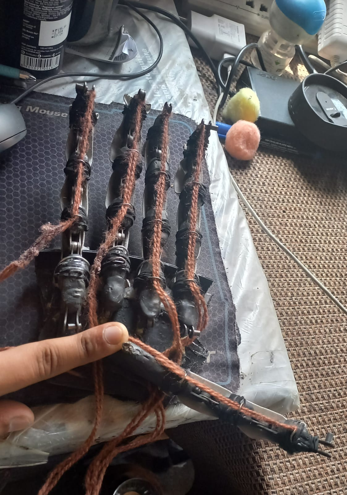
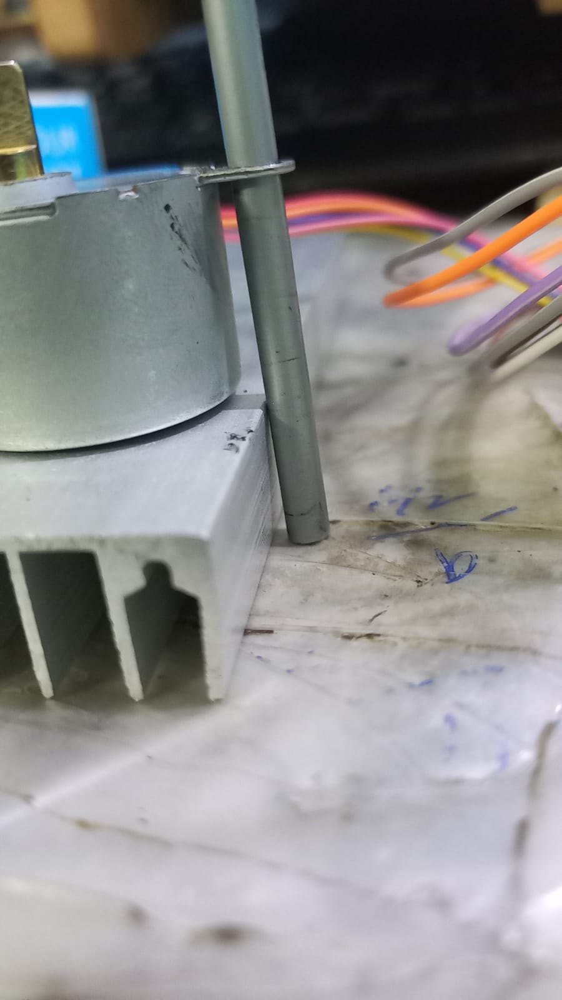
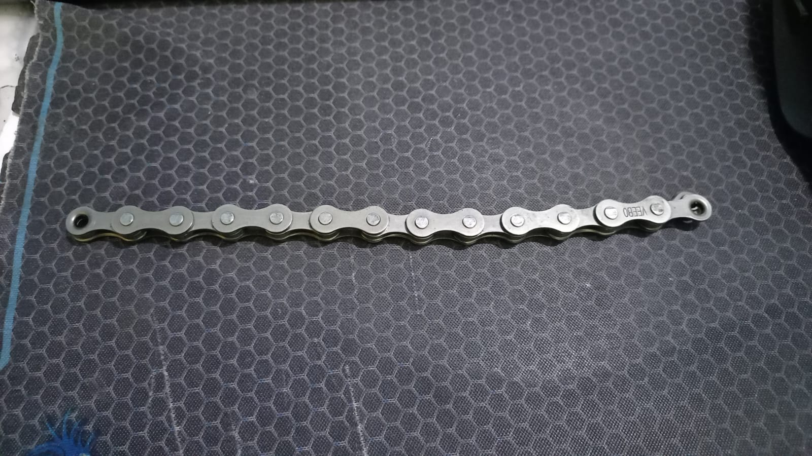

# Project ACRA — Arduino-controlled robotic hand

Proof-of-concept prosthetic **hand** (not a full arm) driven by stepper motors and an Arduino. The mechanical design uses bicycle chain links, elastics, and cord so the fingers can clutch balls and other objects with a roughly human range of motion.

There are no formal CAD schematics — the mechanism started as a high-school idea and was built later in spare time. Datasheets for the drivers and motors are kept under `docs/hardware/`.

## Build photos







Full gallery: [docs/media/](docs/media/) (`build-01.jpg` … `build-39.jpg`).

## Hardware notes

| Part | Document |
| --- | --- |
| A4988 stepper wiring | [docs/hardware/a4988-stepper-wiring.jpg](docs/hardware/a4988-stepper-wiring.jpg) |
| LM2596 buck converter | [docs/hardware/lm2596-buck-converter.pdf](docs/hardware/lm2596-buck-converter.pdf) |
| ULN2003 | [docs/hardware/uln2003-datasheet.pdf](docs/hardware/uln2003-datasheet.pdf) |
| Stepper motor | [docs/hardware/stepper-motor-datasheet.pdf](docs/hardware/stepper-motor-datasheet.pdf) |
| Mark VI fingers / palm (print refs) | [fingers](docs/hardware/mark-vi-fingers.pdf) · [palm](docs/hardware/mark-vi-right-palm.pdf) |

Firmware uses 28BYJ-48-style steppers (`STEPS 2038`) for thumb, pointer, middle, ring, and pinky.

## Firmware

- Experiments: [`Codes/stepper_tests/stepper_tests.ino`](Codes/stepper_tests/stepper_tests.ino)
- Combined finger control: [`Final_ACRA_codes/Test_run.ino`](Final_ACRA_codes/Test_run.ino)

1. Install the Arduino IDE and the standard `Stepper` library.
2. Open the sketch that matches your wiring.
3. Select the board and port, then upload.

## Layout

```
Codes/                 early stepper tests
Final_ACRA_codes/      combined hand sketch
docs/hardware/         datasheets and wiring
docs/media/            build photos
```
